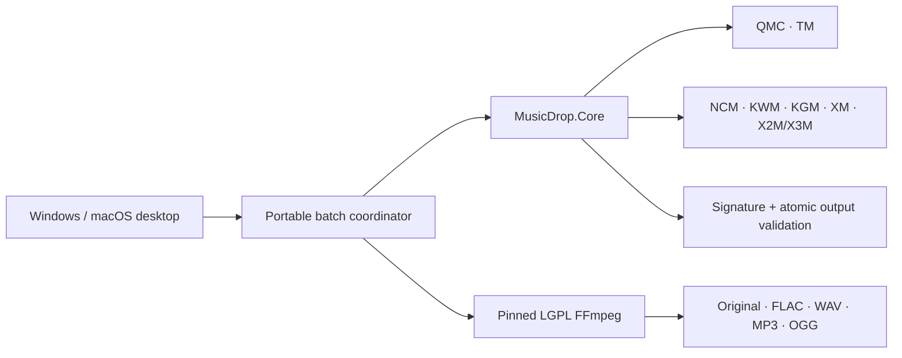

<p align="center">
  
</p>

<h1 align="center">MusicDrop™</h1>

<p align="center"><strong>Complexity in the core. Conversion in one drop.</strong></p>

<p align="center"><a href="README.zh-CN.md">简体中文</a> · English</p>

<p align="center">
  <a href="https://github.com/TonyNa-code/MusicDrop/actions/workflows/build.yml"></a>
  <a href="https://github.com/TonyNa-code/MusicDrop/actions/workflows/portable.yml"></a>
  <a href="https://github.com/TonyNa-code/MusicDrop/stargazers"></a>
  
  
</p>

MusicDrop is a local-first batch audio converter for files you are authorized to process. Drop files or folders, select **Original / FLAC / WAV / MP3 / OGG**, and convert without uploading media or modifying the source.

Version 3.1 separates an audited, platform-neutral decryption core from the desktop shell. Windows 10/11 keeps the mature WinForms edition; the new Avalonia desktop and portable CLI build for macOS Intel and Apple Silicon. macOS is a **preview** until its GitHub Actions packages have completed real runner and hardware validation. Windows 7 is a separate planned Legacy port—not a compatibility claim for the current .NET 10 build.

> If MusicDrop saves you time, a ⭐ helps more people discover a private, honest alternative to opaque online converters.

## The 30-second workflow

```text
Drop files or folders  →  Strict preflight  →  Local decode  →  Convert  →  Verify + atomic commit
```

No uploads. No source deletion. No “success” while the payload is still encrypted.

## Why MusicDrop

- **One-drop workflow** — multi-file and recursive folder input, collision-safe naming, parallel preflight and controlled concurrency.
- **Honest success criteria** — real audio signatures, strict all-ready-before-output preflight, full FFmpeg decode verification, and sample-level PCM MD5 for WAV.
- **Local and private** — no account, telemetry, advertising, remote kill switch, media upload or online key service.
- **Source-safe** — originals are never deleted or modified; final files appear only after an atomic temporary-output commit.
- **Performance-oriented** — 1 MiB pooled streaming I/O for QMC/NCM/KWM/KGM and bounded batch workers instead of loading songs into memory.
- **Reproducible media engine** — pinned Windows LGPL FFmpeg; macOS workflow builds the same pinned FFmpeg revision from source with GPL/nonfree features disabled.
- **Bilingual desktop** — Chinese and English UI, local EKey keyring selection, and KGM v5 database selection.

## Offline coverage

| Family | Offline path | Required local material |
| --- | --- | --- |
| QQ/QMC, MFLAC, MGG | Static v1, embedded EKey, QTag; MusicEx/STag through a verified local keyring | Per-file EKey only when the file does not contain one |
| QQ iOS TM0/TM2/TM3/TM6 | Header validation/restoration | None |
| NetEase Cloud Music NCM | Deterministic streaming decryption | None |
| Kuwo KWM/KW | Deterministic streaming decryption | None |
| Kugou KGM/KGMA/VPR/KGG v3 | Deterministic streaming decryption | None |
| Kugou KGM v5 | AudioHash → EKey lookup and streaming decryption | Matching entry in a local `KGMusicV3.db` |
| Xiami XM | Validated partial-XOR stream | None |
| Ximalaya X2M/X3M | Validated 1024-byte header unscramble | None |
| Standard audio | FLAC, WAV, MP3, OGG/Opus, M4A/MP4, AAC, APE, WMA, AIFF, DSF and DFF | None |

An extension alone is never treated as proof. Every encrypted route must decrypt to a recognized audio signature. Platform updates can introduce new variants, corrupted files exist, and some modern downloads omit the per-file key; MusicDrop therefore does **not** promise literal “100% of every file.” A missing key is reported as a hard stop, not a successful conversion.

See the detailed [support matrix](docs/SUPPORTED_FORMATS.md).

## Architecture



Platform-specific client discovery, Windows DPAPI, Authenticode and process containment remain outside `MusicDrop.Core`. That boundary lets macOS reuse the proven offline algorithms without pretending Windows-only compatibility mechanisms are portable. Details: [architecture](docs/ARCHITECTURE.md).

## Getting started

### Windows 10/11 x64

Download a `Full-Windows-x64.zip` release, extract it and run `MusicDrop3.exe`. Full packages include the pinned LGPL FFmpeg build; no administrator permission, PATH edit or separate FFmpeg installation is required.

The new cross-platform desktop can also be built from `MusicDrop.Desktop`, while the mature WinForms shell remains the recommended Windows release during the 3.1 preview.

### macOS 12+ preview

Release automation produces separate `osx-arm64` and `osx-x64` app archives with the portable CLI and a source-built LGPL FFmpeg bundle. Preview artifacts use ad-hoc signing; a retail-quality download still requires Apple Developer ID signing, notarization and real-device testing. Read [the macOS guide](docs/MACOS.md) before distribution.

### Portable CLI

```bash
musicdrop --input "/Music/Album" --output "/Music/Converted" --format FLAC --jobs 4
musicdrop --input "song.mflac" --probe --qmc-ekey-file "my-local-keyring.json"
musicdrop --input "song.kgm" --format ORIGINAL --kugou-db "KGMusicV3.db"
```

Run `musicdrop --help --lang en` or `musicdrop --help --lang zh` for all options. The CLI accepts a bounded JSON input manifest so the desktop can submit very large batches without command-line-length failures.

## Build and verification

Requires .NET SDK `10.0.301` or the latest compatible feature band.

```bash
dotnet restore MusicDrop.slnx --configfile NuGet.Config
dotnet build MusicDrop.slnx -c Release --no-restore
dotnet run --project MusicDrop.Core.Harness/MusicDrop.Core.Harness.csproj -c Release --no-build
```

The portable solution (`MusicDrop.Portable.slnx`) builds on Windows and macOS. Current regression gates cover eight cross-platform groups plus the existing sixteen Windows integration groups. Synthetic and public fixtures verify byte-exact output, malformed-input rejection, ambiguous `.xm` dispatch, KGM v5 databases, FFmpeg output integrity, collisions and strict batch behavior.

## Editions and trust

The Community edition is MIT-licensed and has no activation. The optional Convenience edition adds a permanently signed offline buyer record—no hardware binding, expiry, network check or audio watermark. Because the source is open, this is low-friction provenance and resale deterrence, not unbreakable DRM. See [seller edition](docs/SELLER_EDITION.md).

MusicDrop does not provide subscription entitlements, service-side keys, account bypasses or copyrighted test media. Only process files you have the right to access, back up or convert, and follow applicable law and platform terms.

## Project documents

- [Architecture](docs/ARCHITECTURE.md)
- [Supported formats](docs/SUPPORTED_FORMATS.md)
- [Performance and reliability](docs/PERFORMANCE.md)
- [macOS packaging](docs/MACOS.md)
- [Windows 7 Legacy plan](docs/WINDOWS7_LEGACY.md)
- [FFmpeg provenance](docs/FFMPEG.md)
- [Security policy](SECURITY.md) · [Privacy](PRIVACY.md) · [Third-party notices](THIRD-PARTY-NOTICES.md)

Source code is under the [MIT License](LICENSE). The `MusicDrop™` name and official artwork have separate identification-use guidance in [TRADEMARKS.md](TRADEMARKS.md); `™` does not claim registration.
