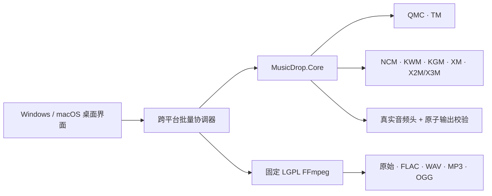

<p align="center">
  
</p>

<h1 align="center">MusicDrop™</h1>

<p align="center"><strong>把复杂留给核心，把转换留给一次拖放。</strong></p>

<p align="center">简体中文 · <a href="README.md">English</a></p>

<p align="center">
  <a href="https://github.com/TonyNa-code/MusicDrop/actions/workflows/build.yml"></a>
  <a href="https://github.com/TonyNa-code/MusicDrop/actions/workflows/portable.yml"></a>
  <a href="https://github.com/TonyNa-code/MusicDrop/stargazers"></a>
  
  
</p>

MusicDrop 是一款面向用户有权处理文件的本地批量音频转换器。拖入文件或文件夹，选择 **原始格式 / FLAC / WAV / MP3 / OGG**，即可转换；媒体不会上传，源文件不会被修改。

3.1 版把经过回归验证的离线解码核心与平台界面正式分离。Windows 10/11 继续保留成熟的 WinForms 版；新的 Avalonia 桌面界面和便携 CLI 可构建为 macOS Intel 与 Apple Silicon 版本。macOS 在 GitHub Actions 构建和真实设备验证完成前标记为**预览版**。Windows 7 则是独立的 Legacy 移植计划，当前 .NET 10 程序不会冒充兼容。

> 如果 MusicDrop 帮你省下了时间，点一个 ⭐ 能让更多人发现这款本地、透明且不虚报成功的转换工具。

## 30 秒上手

```text
拖入文件或文件夹  →  整批严格预检  →  本地解码  →  选择格式  →  验证并原子提交
```

不上传媒体，不删除源文件，不把仍然加密的数据伪装成“转换成功”。

## 为什么选择 MusicDrop

- **一次拖放**：支持多文件、递归文件夹、输出重名避让、并行预检和可控并发。
- **成功必须真实**：检查解密后的真实音频头；整批严格预检；FFmpeg 完整解码校验；WAV 进行逐样本 PCM MD5 对比。
- **隐私优先**：无账号、无遥测、无广告、无远程停用、无媒体上传、无在线密钥服务。
- **源文件安全**：绝不删除或原地修改源文件；只有临时输出完整验证后才原子提交正式文件。
- **性能优先**：QMC/NCM/KWM/KGM 统一使用 1 MiB 池化流式 I/O，批量任务按 CPU 和磁盘压力限制并发，不把整首歌读入内存。
- **可复现媒体引擎**：Windows 固定 LGPL FFmpeg；macOS 工作流从固定源码修订自行构建，并明确禁用 GPL/nonfree 配置。
- **中英双语界面**：支持 QMC 本地 EKey 映射文件和 KGM v5 本地数据库选择。

## 离线解码覆盖

| 格式家族 | 离线路径 | 需要的本地材料 |
| --- | --- | --- |
| QQ/QMC、MFLAC、MGG | 静态 v1、内嵌 EKey、QTag；MusicEx/STag 可使用本地映射文件逐个验证 | 文件未内嵌密钥时需要匹配的文件专属 EKey |
| QQ iOS TM0/TM2/TM3/TM6 | 文件头校验与恢复 | 无 |
| 网易云 NCM | 确定性流式解码 | 无 |
| 酷我 KWM/KW | 确定性流式解码 | 无 |
| 酷狗 KGM/KGMA/VPR/KGG v3 | 确定性流式解码 | 无 |
| 酷狗 KGM v5 | AudioHash 匹配 EKey 后流式解码 | 本地 `KGMusicV3.db` 中存在对应记录 |
| 虾米 XM | 严格验证的部分 XOR 流 | 无 |
| 喜马拉雅 X2M/X3M | 严格验证的 1024-byte 文件头复原 | 无 |
| 普通音频 | FLAC、WAV、MP3、OGG/Opus、M4A/MP4、AAC、APE、WMA、AIFF、DSF、DFF | 无 |

MusicDrop 不会因为扩展名相同就宣称成功。每条解码路径都必须得到可识别的真实音频头。平台可能更新格式，文件可能损坏，新式下载也可能没有文件专属密钥，因此项目不会宣传字面意义的“所有文件 100% 成功”。缺少密钥会明确停止，绝不会把仍加密的数据伪装为成功输出。

详细边界见[格式支持矩阵](docs/SUPPORTED_FORMATS.md)。

## 架构



客户端发现、Windows DPAPI、数字签名检查和进程容器留在平台层；macOS 只复用确实可移植的离线算法，不会把 Windows 专属兼容链路包装成跨平台能力。详见[架构说明](docs/ARCHITECTURE.md)。

## 快速开始

### Windows 10/11 x64

从 Releases 下载 `Full-Windows-x64.zip`，解压后运行 `MusicDrop3.exe`。完整包已经包含固定的 LGPL FFmpeg，不需要管理员权限、PATH 配置或用户另装 FFmpeg。

3.1 预览期也可以从 `MusicDrop.Desktop` 构建新跨平台界面；Windows 正式发行仍优先采用已经充分验证的 WinForms 外壳。

### macOS 12+ 预览

发布工作流分别生成 `osx-arm64` 与 `osx-x64` 应用包，内部包括便携 CLI 和从源码构建的 LGPL FFmpeg。预览包采用 ad-hoc 签名；正式对外销售前还必须完成 Apple Developer ID 签名、公证和真实设备回归。分发前请阅读 [macOS 指南](docs/MACOS.md)。

### 便携命令行

```bash
musicdrop --input "/Music/Album" --output "/Music/Converted" --format FLAC --jobs 4
musicdrop --input "song.mflac" --probe --qmc-ekey-file "my-local-keyring.json"
musicdrop --input "song.kgm" --format ORIGINAL --kugou-db "KGMusicV3.db"
```

运行 `musicdrop --help --lang zh` 查看完整参数。CLI 还支持有大小与条数限制的 JSON 批量清单，使桌面界面可提交超大队列而不受命令行长度限制。

## 构建与验证

需要 .NET SDK `10.0.301` 或同一功能带的更新版本。

```bash
dotnet restore MusicDrop.slnx --configfile NuGet.Config
dotnet build MusicDrop.slnx -c Release --no-restore
dotnet run --project MusicDrop.Core.Harness/MusicDrop.Core.Harness.csproj -c Release --no-build
```

`MusicDrop.Portable.slnx` 可在 Windows 和 macOS 构建。目前发布门槛包含 8 组跨平台核心检查和原有 16 组 Windows 集成检查，覆盖字节级一致性、畸形输入拒绝、`.xm` 格式冲突判别、KGM v5 数据库、FFmpeg 输出完整性、输出重名与整批严格预检。

## 开源版、便利版与边界

社区版采用 MIT 许可且不需要激活。可选的便利版只增加永久离线签名的买家记录：不绑机器、不过期、不联网、不向音频写水印。开源软件不存在不可破解的本地 DRM，因此它属于低摩擦溯源和防倒卖劝阻，而不是虚假的“绝对防破解”。详见[便利版说明](docs/SELLER_EDITION.md)。

MusicDrop 不提供会员权益、平台服务端密钥、账号绕过或受版权保护的测试媒体。请只处理你有权访问、备份或转换的文件，并遵守所在地法律和平台条款。

## 项目文档

- [架构说明](docs/ARCHITECTURE.md)
- [格式支持矩阵](docs/SUPPORTED_FORMATS.md)
- [性能与可靠性](docs/PERFORMANCE.md)
- [macOS 打包与验证](docs/MACOS.md)
- [Windows 7 Legacy 计划](docs/WINDOWS7_LEGACY.md)
- [FFmpeg 来源与许可](docs/FFMPEG.md)
- [安全策略](SECURITY.md) · [隐私说明](PRIVACY.md) · [第三方声明](THIRD-PARTY-NOTICES.md)

源代码采用 [MIT License](LICENSE)。`MusicDrop™` 名称及官方图形的识别性使用规则见 [TRADEMARKS.md](TRADEMARKS.md)；`™` 不表示已经注册。
